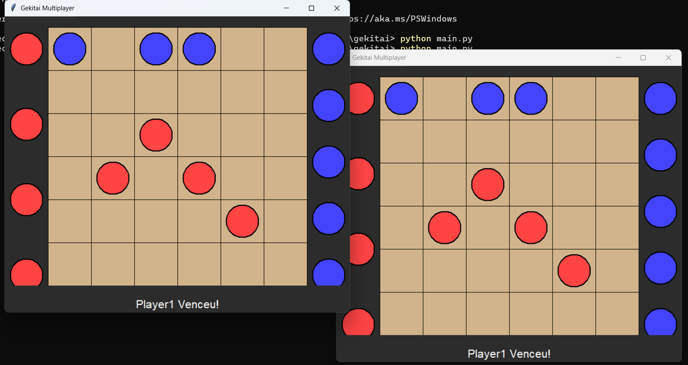
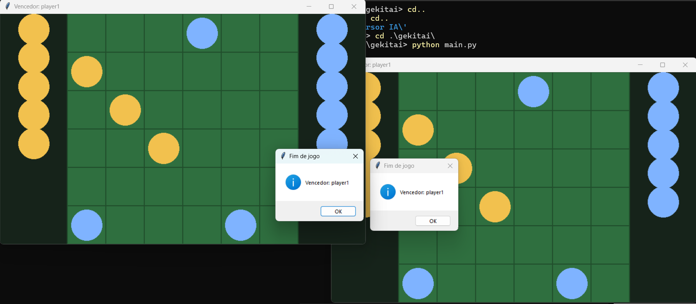

# 🤖 Análise Comparativa de Ferramentas de IA para Programação

Este repositório apresenta uma análise prática comparativa entre duas ferramentas de Inteligência Artificial aplicadas ao desenvolvimento de software:

- **Cursor AI**
- **CodeGeeX**

O objetivo é avaliar o desempenho dessas ferramentas em diferentes cenários de desenvolvimento, considerando não apenas a corretude das soluções, mas também aspectos como eficiência, usabilidade e nível de automação.

---

## 🎯 Objetivo

Investigar como ferramentas de IA auxiliam no desenvolvimento de software em contextos reais, analisando:

- Qualidade do código gerado
- Desempenho das soluções
- Facilidade de uso
- Grau de autonomia (agente vs assistência)
- Consistência dos resultados

---

## 🧪 Metodologia

Os experimentos foram conduzidos utilizando diferentes modos de interação com as ferramentas:

| Modo          | Descrição |
|--------------|----------|
| Autocomplete | Sugestões automáticas durante a escrita |
| Inline       | Geração direta no código |
| Chat         | Interação via prompts |
| Agent        | Execução automatizada com controle global |

Cada ferramenta foi utilizada conforme suas capacidades disponíveis.

---

## 📌 Experimentos Realizados

---

## 🧩 1. Problemas Algorítmicos (LeetCode)

| # | Problema | Dificuldade | Habilidade |
|--|---------|------------|-----------|
| 1 | Two Sum | Fácil | Hash Map / Arrays |
| 2 | Valid Parentheses | Fácil | Stack |
| 3 | Merge Sorted Array | Fácil | Arrays / Two Pointers |
| 4 | 3Sum | Médio | Two Pointers / Sorting |
| 5 | Group Anagrams | Médio | Hashing / Strings |
| 6 | Number of Islands | Médio | DFS/BFS / Matrizes |
| 7 | Trapping Rain Water | Difícil | Two Pointers / DP |
| 8 | Word Ladder | Difícil | Grafos / BFS |
| 9 | LRU Cache | Difícil | Design de Estruturas |

### 🔍 Abordagem

- Utilização majoritária de **autocomplete**
- Enunciado e assinatura fornecidos como comentário no código

### ⚖️ Comparação

**Cursor AI**
- Maior eficiência geral
- Capaz de resolver problemas completos via agente
- Nem sempre acerta na primeira tentativa

**CodeGeeX**
- Mais limitado no autocomplete
- Uso frequente do chat (necessário copiar/colar enunciado)
- Código frequentemente comentado (às vezes em chinês)

---

## 💣 2. Campo Minado (Python)

### 🔍 Abordagem

**Cursor AI**
- Utilização de agente

**CodeGeeX**
- Utilização do modo inline

### ⚖️ Observação

- Resultados aparentemente equivalentes em funcionalidade
- Diferença principal está na experiência de desenvolvimento

📌 *Análise detalhada do código ainda em andamento*

---

## 🚢 3. Batalha Naval (Web)

## 🔍 Descrição do Experimento

Desenvolvimento de um jogo completo de Batalha Naval (Humano vs Máquina) a partir de um único prompt, exigindo:

Estrutura completa de front-end:
index.html
style.css
script.js
Implementação da lógica do jogo em JavaScript
Criação de uma IA com comportamento estratégico progressivo

## ⚖️ Comparação

**CodeGeeX**

Entregou o projeto funcional com boa aderência ao prompt
Implementação inicial da lógica consistente
Necessitou ajustes pontuais:
Suporte a navios horizontais e verticais
Regra de espaçamento entre embarcações

**Cursor AI**

Estrutura e interface corretamente geradas
IA inicialmente incompleta:
Não afundava completamente os navios
Limitava-se a atacar ao redor do primeiro acerto
Após refinamento:
Passou a identificar direção corretamente
Implementou exploração completa da embarcação

---

## ❌⭕ 4. Jogo da Velha Multiplayer (Python)

### 🔍 Abordagem

**CodeGeeX**
- Implementação via inline
- Funciona corretamente, porém:
  - ❗ apresenta falha ao reiniciar o jogo

**Cursor AI**
- Implementação via agente
- Sistema completo:
  - Cliente-servidor com sockets
  - Interface gráfica
  - Seleção de modo (servidor/cliente)

---

## 🧠♟️ 5. Gekitai Multiplayer Modular (Python)

### 🖼️ Resultados

**CodeGeeX**

**Cursor AI**

---

### 🔍 Descrição do Experimento

Desenvolvimento de um jogo inspirado em **Gekitai**, com maior complexidade arquitetural:

- Tabuleiro 6x6
- Mecânica de empurrão em 8 direções
- Sistema de reservas de peças
- Condições de vitória (alinhamento ou bloqueio)
- Interface gráfica com Tkinter
- Comunicação multiplayer via sockets TCP
- Uso de threads para sincronização

Estrutura modular obrigatória:

- `game_logic.py`
- `network.py`
- `ui.py`
- `main.py`

---

### ⚖️ Comparação

**CodeGeeX**
- Interpretou o prompt global e gerou os 4 arquivos diretamente
- Sistema funcional com poucos ajustes
- Necessidade de copiar/colar código manualmente
- Boa qualidade inicial da interface

**Cursor AI**
- Inicialmente implementou apenas parte do sistema com prompt global
- Após refinamento com prompts adicionais:
  - Gerou todos os módulos corretamente
- Corrigiu erros rapidamente via interação
- Forte capacidade de ajuste incremental

---

### 🎨 Interface Gráfica

- Ambas as ferramentas produziram interfaces equivalentes
- Diferenças apenas estéticas (cores)

**Diferencial:**

- Cursor AI facilita refinamento da interface via agente
- CodeGeeX exige nova interação manual para ajustes

---

### 🧠 Insight Principal

Este experimento evidenciou dois paradigmas distintos:

- **CodeGeeX**: geração completa a partir de instruções explícitas
- **Cursor AI**: desenvolvimento iterativo com suporte contínuo

---

## 📊 Resultados Preliminares (LeetCode)

📎 Planilha completa:  
https://docs.google.com/spreadsheets/d/1SDyIRqPXjtoc-X6BqTGfE461HPlbLjNK3QUm4LkaxF0/edit?gid=0#gid=0

### 📌 Principais Insights

- Ambas as ferramentas atingiram **100% de corretude**
- Diferenças aparecem em:
  - Tempo de execução
  - Uso de memória
  - Consistência

### ⚖️ Comparação Geral

| Critério              | Cursor AI 🟢 | CodeGeeX 🔵 |
|----------------------|-------------|------------|
| Acertividade         | ⭐⭐⭐⭐⭐       | ⭐⭐⭐⭐⭐       |
| Consistência         | ⭐⭐⭐⭐⭐       | ⭐⭐⭐         |
| Automação (Agent)    | ⭐⭐⭐⭐⭐       | ⭐⭐ (beta)  |
| Facilidade de uso    | ⭐⭐⭐⭐⭐       | ⭐⭐⭐        |
| Intervenção manual   | Baixa       | Alta        |

---

## 🧠 Análise Geral

### 🟢 Cursor AI
- Mais consistente
- Melhor integração com fluxo de desenvolvimento
- Forte em desenvolvimento iterativo
- Menor necessidade de intervenção manual

### 🔵 CodeGeeX
- Excelente geração inicial de código
- Boa aderência a prompts completos
- Maior dependência de interação manual
- Limitações no modo agente (beta)

---

## ⚠️ Limitações Observadas

- Necessidade de ajustes manuais em ambas as ferramentas
- Variação de desempenho dependendo da linguagem
- Instabilidade em funcionalidades mais avançadas

---

## 🧠 Conclusão

Ambas as ferramentas demonstraram alta capacidade técnica, sendo capazes de implementar desde algoritmos até sistemas multiplayer completos.

- **Cursor AI** se destaca pela automação, consistência e suporte ao desenvolvimento iterativo
- **CodeGeeX** se destaca pela capacidade de gerar soluções completas rapidamente a partir de instruções bem definidas

📌 A escolha da ferramenta ideal depende do fluxo de desenvolvimento:
- geração inicial → CodeGeeX  
- evolução e manutenção → Cursor AI  

---

## 👥 Equipe

- Leonardo Costa de Sousa
- (Adicionar demais integrantes)

---
