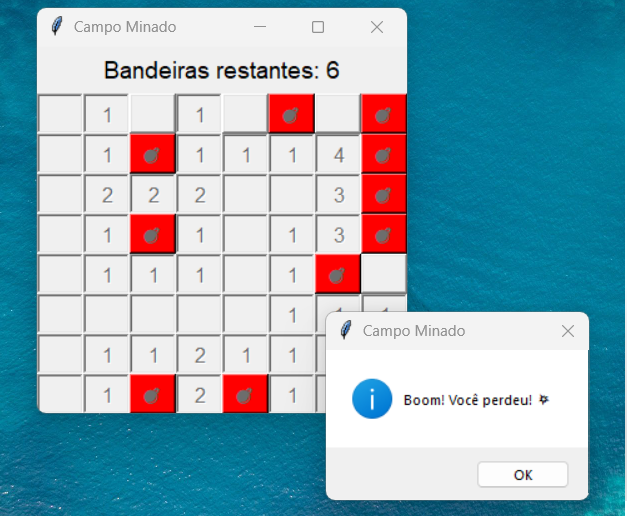
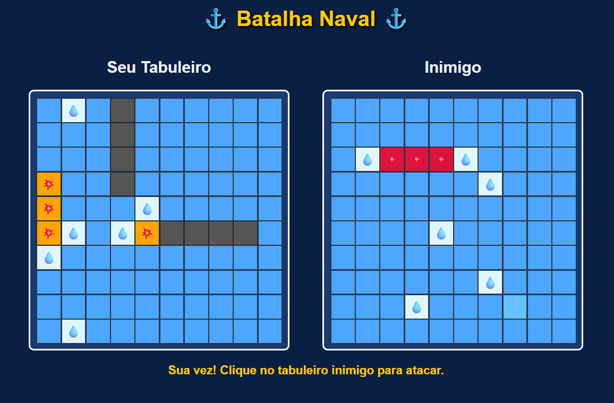
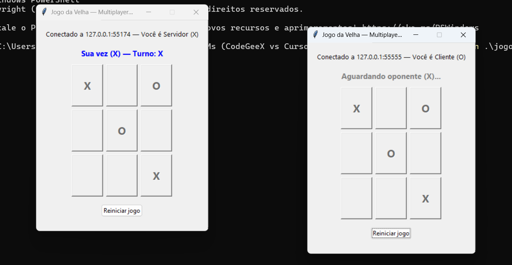

# 🤖 Análise Comparativa de Ferramentas de IA para Programação

Este repositório apresenta uma análise prática comparativa entre duas ferramentas de Inteligência Artificial aplicadas ao desenvolvimento de software:

- **Cursor AI**
- **CodeGeeX**

O objetivo é avaliar o desempenho dessas ferramentas em diferentes cenários de desenvolvimento, considerando não apenas a corretude das soluções, mas também aspectos como eficiência, usabilidade e nível de automação.

---

## 🎯 Objetivo

Investigar como ferramentas de IA auxiliam no desenvolvimento de software em contextos reais, analisando:

- Qualidade do código gerado
- Desempenho das soluções
- Facilidade de uso
- Grau de autonomia (agente vs assistência)
- Consistência dos resultados

---

## 🧪 Metodologia

Os experimentos foram conduzidos utilizando diferentes modos de interação com as ferramentas:

| Modo          | Descrição |
|--------------|----------|
| Autocomplete | Sugestões automáticas durante a escrita |
| Inline       | Geração direta no código |
| Chat         | Interação via prompts |
| Agent        | Execução automatizada com controle global |

Cada ferramenta foi utilizada conforme suas capacidades disponíveis.

---

## 📌 Experimentos Realizados

---

## 🧩 1. Problemas Algorítmicos (LeetCode)

| # | Problema | Dificuldade | Habilidade |
|--|---------|------------|-----------|
| 1 | Two Sum | Fácil | Hash Map / Arrays |
| 2 | Valid Parentheses | Fácil | Stack |
| 3 | Merge Sorted Array | Fácil | Arrays / Two Pointers |
| 4 | 3Sum | Médio | Two Pointers / Sorting |
| 5 | Group Anagrams | Médio | Hashing / Strings |
| 6 | Number of Islands | Médio | DFS/BFS / Matrizes |
| 7 | Trapping Rain Water | Difícil | Two Pointers / DP |
| 8 | Word Ladder | Difícil | Grafos / BFS |
| 9 | LRU Cache | Difícil | Design de Estruturas |

### 🔍 Abordagem

- Utilização majoritária de **autocomplete**
- Enunciado e assinatura fornecidos como comentário no código

### ⚖️ Comparação

**Cursor AI**
- Maior eficiência geral
- Capaz de resolver problemas completos via agente
- Nem sempre acerta na primeira tentativa

**CodeGeeX**
- Mais limitado no autocomplete
- Uso frequente do chat (necessário copiar/colar enunciado)
- Código frequentemente comentado (às vezes em chinês)

---

## 💣 2. Campo Minado (Python)



### 🔍 Abordagem

**Cursor AI**
- Utilização de agente

**CodeGeeX**
- Utilização do modo inline

### ⚖️ Observação

- Resultados aparentemente equivalentes em funcionalidade
- Diferença principal está na experiência de desenvolvimento

📌 *Análise detalhada do código ainda em andamento*

---

## 🚢 3. Batalha Naval (Web)



### 🔍 Estrutura Inicial

Arquivos já existentes:
- `index.html`
- `style.css`

Implementação realizada pela IA:
- `script.js`

### ⚖️ Comparação

**Cursor AI**
- Utilizou modo agente
- Implementação mais direta

**CodeGeeX**
- Utilizou chat
- Necessário fornecer todo o contexto:
  - HTML
  - CSS
  - Estrutura geral

### 🎨 Diferencial

- CodeGeeX adicionou:
  - Estilização adicional via JavaScript
  - Elementos visuais:
    - 💧 Gota (erro)
    - 💥 Explosão (acerto)

---

## ❌⭕ 4. Jogo da Velha Multiplayer (Python)



### 🔍 Abordagem

**CodeGeeX**
- Implementação via inline
- Funciona corretamente, porém:
  - ❗ apresenta falha ao reiniciar o jogo

**Cursor AI**
- Implementação via agente
- Sistema completo:
  - Cliente-servidor com sockets
  - Interface gráfica
  - Seleção de modo (servidor/cliente)

---

## 📊 Resultados Preliminares (LeetCode)

📎 Planilha completa:  
https://docs.google.com/spreadsheets/d/1SDyIRqPXjtoc-X6BqTGfE461HPlbLjNK3QUm4LkaxF0/edit?gid=0#gid=0

### 📌 Principais Insights

- Ambas as ferramentas atingiram **100% de corretude**
- Diferenças aparecem em:
  - Tempo de execução
  - Uso de memória
  - Consistência

### ⚖️ Comparação Geral

| Critério              | Cursor AI 🟢 | CodeGeeX 🔵 |
|----------------------|-------------|------------|
| Acertividade         | ⭐⭐⭐⭐⭐       | ⭐⭐⭐⭐⭐       |
| Consistência         | ⭐⭐⭐⭐⭐       | ⭐⭐⭐         |
| Automação (Agent)    | ⭐⭐⭐⭐⭐       | ⭐⭐ (beta)  |
| Facilidade de uso    | ⭐⭐⭐⭐⭐       | ⭐⭐⭐        |
| Intervenção manual   | Baixa       | Alta        |

---

## 🧠 Análise Geral

### 🟢 Cursor AI
- Mais consistente
- Melhor integração com fluxo de desenvolvimento
- Suporte eficiente a agentes
- Menor necessidade de intervenção manual

### 🔵 CodeGeeX
- Resultados variáveis
- Pode gerar soluções muito boas em alguns casos
- Maior dependência de interação manual
- Limitações no modo agente (em fase beta)

---

## ⚠️ Limitações Observadas

- Necessidade de ajustes manuais em ambas as ferramentas
- Variação de desempenho dependendo da linguagem
- Instabilidade em funcionalidades mais avançadas (ex: agente no CodeGeeX)

---

## 🧠 Conclusão

Ambas as ferramentas demonstraram capacidade de resolver problemas corretamente, porém com diferenças claras em termos de usabilidade e consistência.

- **Cursor AI** se destaca pela automação e estabilidade
- **CodeGeeX** apresenta maior variabilidade, exigindo maior intervenção do usuário

📌 Ferramentas com suporte a agentes tendem a oferecer maior produtividade em cenários reais de desenvolvimento.

---

## 👥 Equipe

- Leonardo Costa de Sousa
- (Adicionar demais integrantes)

---

## 🚀 Como Executar

### Campo Minado
```bash
python main.py